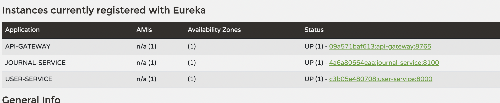

# User Event Journaling System

## Project Overview

This project is a **User Event Journal System** that helps to do CRUD operations on a USER while ensuring secure role-based access. It features two user roles:

- **USER**:
    - Can create and update the user details.
    - Cannot delete the user
    - Can see the journals of a particular user by id

- **ADMIN**:
    - Can perform CRUD operations on a user.
    - It can view all the journal events as well as journal events of a particular user by id.

To ensure security, **JWT authentication with Spring Security** is implemented for protected routes, maintaining data privacy and controlled access. 

### Components used
- zookeeper  (taken as a docker image)
- kafka  (taken as a docker image)
- Spring cloud api gateway
- User microservice
- Journal microservice
- Eureka naming server
- H2 in-memory database

### API Endpoints and Role Permissions

**Note:- The base url will be :- http://localhost:8765**

| All Endpoints                                                                      | ADMIN | USER |
|------------------------------------------------------------------------------------|:-----:|:----:|
| **Register a new user** `POST /api/auth/signup`                                   | ✅    | ✅   |
| **User login** `POST /api/auth/login`                                             | ✅    | ✅   |
| **Fetch user by id** `GET /api/users/{id}`                                        | ✅    | ❌   |
| **Fetch all users** `GET /api/users`                                              | ✅    | ❌   |
| **Update user by id** `PATCH /api/users/{id}`                                     | ✅    | ✅   |
| **Delete user by id** `DELETE /api/users/{id}`                                    | ✅    | ❌   |
| **Fetch all user journal events** `GET /api/journals`                             | ✅    | ❌   |
| **Fetch all user journal events of a specific user by id** `GET /api/journals/user/{id}` | ✅    | ✅   |


**Note**:- We will need to pass request body in case of POST and PATCH requests above, which I will show in below steps.

## 2. System Requirements

- Java: Version 17 or higher
- Spring Boot: Version 3.x
- Build Tool: Maven 3.2.2 or higher
- Other Tools: Postman (for API testing), Docker

## 3. Running instructions
Note:- I assume you have Docker installed in your system. If not please do that first, and then follow below steps.

### Go to the Repository

```
https://github.com/subhajit100/user-journal-microservices-java-springboot
```

### Find the docker-compose.yml file

- The file will be present at the root of the github project. 
- Copy that file into your local with same name. 
- Open the terminal or Command Prompt (based on your OS) in the same directory where your docker-compose.yml file is present.

### Run the below command

```
docker-compose up
```
- Wait till it pulls the images from the remote registry.

### Check Eureka naming server

- The Eureka naming server will be running on address:- http://localhost:8761/

- You should wait till the above address shows all the three microservices up and running. You should see something similar to below image.



- Once above all three services are available, then you can test the API's.

#### Note:- The Api gateway is hosted on port: 8765 , which is the centralized gateway for all routes.


**Suggestion** :- Create multiple ADMIN and USER during signup with different details to have a good collection to play with API routes.

### Testing API endpoints for ADMIN

- Let's start with creating a user with role **ADMIN**:-
```
POST   http://localhost:8765/api/auth/singup
```
Sample Request Body:- 
```
{
  "username": "john101",
  "password": "jpass",
  "email": "john@gm.coo",
  "firstName": "John",
  "lastName": "Doe",
  "role": "ADMIN"
}
```

- Login to get the JWT token back
```
POST   http://localhost:8765/api/auth/login
```
Sample Request Body:-
```
{
  "username": "john101",
  "password": "jpass",
}  
```

Sample Response body:-
```
User logged in successfully
```

Sample Response header:-
```
authorization = <JWT_TOKEN>
```

- Copy the above <JWT_TOKEN> and add it to the bearer token in the below manner, before making any further requests:-
```
Bearer <JWT_TOKEN>
```

NOTE:- Signup and Login routes are public, but to access further below routes, you need a <JWT_TOKEN> , which is added as a part of bearer auth token above.

- Fetch all users 
```
GET   http://localhost:8765/api/users
```

Reminder:- Check if you have added the bearer auth token received after login, if the above API doesn't work.

- Fetch a specific user by id
```
GET   http://localhost:8765/api/users/1 
```

- Deleting a user by id
```
DELETE   http://localhost:8765/api/users/1 
```

- Fetch all user journal events
```
GET    /api/journals 
```


### Testing API endpoints for USER

- Now we will create a user with role **USER**:-
```
POST   http://localhost:8765/api/auth/singup
```
Sample Request Body:-
```
{
  "username": "subhajit800",
  "password": "spass",
  "email": "subh@gm.coo",
  "firstName": "Subhajit",
  "lastName": "Adhikary",
  "role": "USER"
}
```

Login to get the JWT token back
```
POST   http://localhost:8765/api/auth/login
```
Sample Request Body:-
```
{
  "username": "subhajit800",
  "password": "spass",
}  
```

Sample Response body:-
```
User logged in successfully
```

Sample Response header:-
```
authorization = <JWT_TOKEN>
```

### Testing common API endpoints accessible for both ADMIN and USER


- Update a user by by id
```
PATCH   http://localhost:8765/api/users/2
```
Note:- Only email, firstName and lastName can updated <br/>
Sample Request Body:-
```
{
  "firstName": "Jacob",
}
```

- Fetch all user journal events of a specific user by id
```
GET    http://localhost:8765/api/journals/user/2    
```

### Stop all docker containers
- Press ``` CTRL + C ``` to stop all docker containers. 
- Ideal way:- Open a new terminal in the same directory of docker-compose.yml file, and run the below command:-
```
docker-compose down
```

### PS
- If some api doesn't work, check if that user has the authority to access that API or not (based on ADMIN/USER role). 
- Also see if you are using the correct user id in path of the url, may be you have deleted that in previous call?

